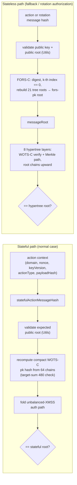
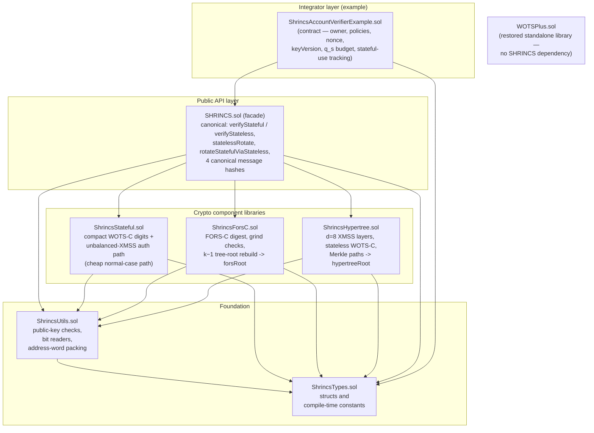

# SHRINCS Solidity Verifier

This repository contains a Solidity verifier-oriented implementation of the SHRINCS signature construction.


## What SHRINCS Is

In this codebase, SHRINCS is a two-path signature design:

- a **stateful path**
  - cheap normal-case verification
  - based on compact `WOTS-C` plus an unbalanced XMSS-style authentication path
- a **stateless path**
  - fallback / recovery verification path
  - based on a SPHINCS-style `FORS-C + hypertree + WOTS-C` structure

The high-level idea is:

- normal operation uses the cheaper stateful path
- a restored or degraded signer can use the stateless path
- the verifier only checks signatures and rotation authorizations; it does not track signer state

## Verification Flow



## Repository Shape

Main contracts:

- [contracts/SHRINCS.sol](./contracts/SHRINCS.sol)
  - main verifier library
- [contracts/ShrincsTypes.sol](./contracts/ShrincsTypes.sol)
  - shared structs and compile-time constants
- [contracts/ShrincsUtils.sol](./contracts/ShrincsUtils.sol)
  - shared public-key checks, bit reads, and address packing helpers
- [contracts/ShrincsStateful.sol](./contracts/ShrincsStateful.sol)
  - stateful `WOTS-C` reconstruction and unbalanced XMSS-style path verification
- [contracts/ShrincsForsC.sol](./contracts/ShrincsForsC.sol)
  - `FORS-C` digest extraction and root reconstruction
- [contracts/ShrincsHypertree.sol](./contracts/ShrincsHypertree.sol)
  - stateless `WOTS-C` and hypertree layer verification
- [contracts/WOTSPlus.sol](./contracts/WOTSPlus.sol)
  - legacy `WOTS+` implementation retained alongside the SHRINCS verifier
- [contracts/examples/ShrincsAccountVerifierExample.sol](./contracts/examples/ShrincsAccountVerifierExample.sol)
  - example account wrapper that owns nonce, rotation, and policy state

Architecture:



Tests:

- [test/ShrincsSphincs256sVectors.t.sol](./test/ShrincsSphincs256sVectors.t.sol)
  - vector-backed verification and rotation-authorization tests
- [test/ShrincsAccountVerifierExample.t.sol](./test/ShrincsAccountVerifierExample.t.sol)
  - wrapper integration and state-transition tests
- [test/ShrincsStatefulPolicyExamples.t.sol](./test/ShrincsStatefulPolicyExamples.t.sol)
  - stateful-use policy tests
- [test/ShrincsSignerKeygen.t.sol](./test/ShrincsSignerKeygen.t.sol)
  - test-only Solidity keygen and Rust-golden-output checks
- [test/ShrincsSignerStateful.t.sol](./test/ShrincsSignerStateful.t.sol)
  - test-only stateful signer helper tests
- [test/ShrincsSignerStatefulAction.t.sol](./test/ShrincsSignerStatefulAction.t.sol)
  - canonical stateful-action signer helper tests
- [test/ShrincsStatelessVectorSigner.t.sol](./test/ShrincsStatelessVectorSigner.t.sol)
  - staged stateless vector signer and facade tests
- [test/ShrincsAccountSigningFacade.t.sol](./test/ShrincsAccountSigningFacade.t.sol)
  - wrapper-aware test signer facade tests
- [test/ShrincsAccountVectorExport.t.sol](./test/ShrincsAccountVectorExport.t.sol)
  - wrapper-feedable bundle export tests
- [test/ShrincsToyStatelessProfile.t.sol](./test/ShrincsToyStatelessProfile.t.sol)
  - small stateless-profile sanity tests
- [test/WOTSPlus.t.sol](./test/WOTSPlus.t.sol)
  - restored legacy `WOTS+` tests

Test vectors:

- [test/test_vectors/shrincs_sphincs_256s_keccak.json](./test/test_vectors/shrincs_sphincs_256s_keccak.json)
- [test/test_vectors/shrincs_account_wrapper_vectors.json](./test/test_vectors/shrincs_account_wrapper_vectors.json)
- [test/test_vectors/wotsplus_keccak256.json](./test/test_vectors/wotsplus_keccak256.json)

## Using Rust-Generated SHRINCS Vectors

The Solidity verifier tests are intended to consume vectors generated by the
Rust SHRINCS signer/keygen implementation. The production Solidity contracts
verify those vectors; they do not generate signing material.

Test-only Solidity helpers under [`test/helpers/`](./test/helpers/) can generate
local signing material for tests and vector-export flows. That test surface is
separate from the production verifier contracts.

The vector file expected by this repository is:

```text
test/test_vectors/shrincs_sphincs_256s_keccak.json
```

From the Rust repository, generate the vector file:

```bash
cargo test --test generate_shrincs_vectors -- --ignored --nocapture
```

The Rust generator writes:

```text
tests/test_vectors/shrincs_sphincs_256s_keccak.json
```

Copy that file into this Solidity repository:

```bash
cp /path/to/hashsigs-rs/tests/test_vectors/shrincs_sphincs_256s_keccak.json \
  /path/to/hashsigs-solidity/test/test_vectors/shrincs_sphincs_256s_keccak.json
```

Then run the SHRINCS-only Solidity tests:

```bash
forge test --match-contract ShrincsSphincs256sVectorsTest -vv
forge test --match-contract ShrincsAccountVerifierExampleTest -vv
```

The vector JSON contains the Rust-generated public keys, messages, signatures,
and negative/tampered cases. It also includes compatibility calldata fields used
by the current Foundry vector decoder.

## Test-Only Signer Helpers

This repository now also contains test-only Solidity signer helpers under
[`test/helpers/`](./test/helpers/). These are not part of the production
verifier surface in [`contracts/`](./contracts/).

- [`test/helpers/ShrincsTestSigner.sol`](./test/helpers/ShrincsTestSigner.sol)
  - deterministic Solidity keygen plus stateful signing helpers
  - used to mirror Rust signer behavior in tests
  - rejects `maxStatefulSignatures == 0` and values above the test-helper cap of `4096`
- [`test/helpers/ShrincsStatelessVectorSigner.sol`](./test/helpers/ShrincsStatelessVectorSigner.sol)
  - staged storage-backed stateless signer for exact production-profile vector generation
  - splits FORS and hypertree work across multiple calls to avoid EVM memory blowups
- [`test/helpers/ShrincsStatelessVectorSigningFacade.sol`](./test/helpers/ShrincsStatelessVectorSigningFacade.sol)
  - thin test facade that drives the staged stateless signer through a simpler
    `signFromSeed(...)` / `completeSession(...)` API
- [`test/helpers/ShrincsAccountSigningFacade.sol`](./test/helpers/ShrincsAccountSigningFacade.sol)
  - test-only account-aware signer facade for canonical wrapper flows
  - rebuilds the live wrapper-owned `domainSeparator`, `nonce`, and `keyVersion`
    before signing stateful actions, stateless actions, and both rotation messages
- [`test/helpers/ShrincsAccountVectorExport.sol`](./test/helpers/ShrincsAccountVectorExport.sol)
  - packages account-aware signatures into wrapper-feedable bundles
  - exports canonical message bytes, `abi.encodeCall(...)` payloads, and ERC-1271 envelopes

Use these helpers for tests, debugging, and local vector generation only. They
should not be treated as deployable wallet or signer contracts.

## Account-Aware Signer And Export Flow

The account wrapper signs canonical, wrapper-owned messages. That means test
signing must bind:

- `domainSeparator`
- `nonce`
- `keyVersion`
- `actionType`
- `payloadHash`

for action flows, and the wrapper-owned rotation context for recovery flows.

The test-only account-aware path is:

- [`test/helpers/ShrincsAccountSigningFacade.sol`](./test/helpers/ShrincsAccountSigningFacade.sol)
  - creates wrapper-bound stateful action signatures
  - creates wrapper-bound stateless action signatures
  - creates wrapper-bound stateless recovery signatures for
    `rotateToFreshKey(...)` and `rotateFullKey(...)`
- [`test/helpers/ShrincsAccountVectorExport.sol`](./test/helpers/ShrincsAccountVectorExport.sol)
  - converts those signatures into exportable bundles that can be fed directly
    into the live wrapper
- [`test/ShrincsAccountVectorExport.t.sol`](./test/ShrincsAccountVectorExport.t.sol)
  - emits the bundle bytes and immediately proves the wrapper accepts them

Run the export suite directly:

```bash
forge test --match-path test/ShrincsAccountVectorExport.t.sol -vv
```

Or generate a JSON artifact from the emitted bundle bytes:

```bash
cd hashsigs-solidity
bash dev/export-account-vectors.sh
```

The default output artifact is:

```text
hashsigs-solidity/test/test_vectors/shrincs_account_wrapper_vectors.json
```

To cross-check these Solidity-exported account vectors against the Rust
verifier, copy that JSON into the Rust repository manually. The repositories
are separate, so this handoff is intentionally not automated:

```bash
cp /path/to/hashsigs-solidity/test/test_vectors/shrincs_account_wrapper_vectors.json \
  /path/to/hashsigs-rs/tests/test_vectors/shrincs_account_wrapper_vectors.json
```

Then run the Rust-side cross-check from `hashsigs-rs`:

```bash
cargo test --test solidity_account_vectors -- --ignored
```

The export tests emit four wrapper-feedable bundle categories:

- `testExportStatefulActionBundle`
  - `stateful_vector_abi`:
    ABI encoding of the full exported stateful-action bundle
  - `stateful_verify_calldata`:
    calldata for `verifyStatefulAction(...)`
  - `stateful_1271_envelope`:
    ERC-1271 payload for canonical stateful-action validation
- `testExportStatelessActionBundle`
  - `stateless_vector_abi`:
    ABI encoding of the full exported stateless-action bundle
  - `stateless_verify_calldata`:
    calldata for `verifyStatelessAction(...)`
  - `stateless_1271_envelope`:
    ERC-1271 payload for canonical stateless-action validation
- `testExportStatefulOnlyRotationBundle`
  - `stateful_rotation_vector_abi`:
    ABI encoding of the full exported stateful-only rotation bundle
  - `stateful_rotation_calldata`:
    calldata for `rotateToFreshKey(...)`
- `testExportFullRotationBundle`
  - `full_rotation_vector_abi`:
    ABI encoding of the full exported full-rotation bundle
  - `full_rotation_calldata`:
    calldata for `rotateFullKey(...)`

These exports are intended for local tooling, debugging, and cross-repo vector
work. They are not a production signer interface.

## Public-Key Shape

The SHRINCS public key exposed by this implementation contains:

- `publicKeyCommitment`
- `statefulPublicKey`
- stateless `pkSeed`
- stateless `hypertreeRoot`

The stateless side follows the SPHINCS+/FIPS-style `PK = (PK.seed, PK.root)` abstraction:

- `pkSeed` is the global public seed used by FORS and the hypertree
- `hypertreeRoot` is the stateless public root

The full hybrid bundle is then bound together by `publicKeyCommitment`. The verifier checks that:

- `publicKey.publicKeyCommitment` matches the commitment recomputed from
  - `statefulPublicKey`
  - `pkSeed`
  - `hypertreeRoot`
- the expected installed public key commitment matches that declared bundle commitment

This keeps the repo's hybrid stateful/stateless public key coherent while preserving the SPHINCS-style stateless core.

## Available Verifier Paths

### 1. Stateful verification

```solidity
SHRINCS.verifyStateful(expectedCompositePublicKey, publicKey, actionContext, signature)
```

`verifyStateful(...)` is the account-style path. It computes a canonical hash from `ActionContext`:

- `domainSeparator`
- `nonce`
- `keyVersion`
- `actionType`
- `payloadHash`

`payloadHash` should be the hash of a typed action payload. The verifier does not accept free-form account-operation bytes on this path.

The account-style path also rejects invalid contexts:

- `expectedCompositePublicKey == 0`
- `domainSeparator == 0`
- `actionType == 0`
- `payloadHash == 0`

Both forms verify:

- the provided `expectedCompositePublicKey` matches `publicKey.publicKeyCommitment`
- the embedded stateful public key
- compact `WOTS-C` reconstruction
- the unbalanced XMSS-style authentication path

### 2. Stateless verification

```solidity
SHRINCS.verifyStateless(expectedCompositePublicKey, publicKey, actionContext, signature)
```

`verifyStateless(...)` is the account-style path. It computes a canonical hash from `ActionContext`.

`payloadHash` should be the hash of a typed action payload.

The account-style path also rejects invalid contexts:

- `expectedCompositePublicKey == 0`
- `domainSeparator == 0`
- `actionType == 0`
- `payloadHash == 0`

Both forms verify:

- the provided `expectedCompositePublicKey` matches `publicKey.publicKeyCommitment`
- `FORS-C`
- hypertree layer traversal
- stateless `WOTS-C`
- final hypertree root against the public key

### 3. Stateful-key rotation authorization

```solidity
SHRINCS.rotateStatefulViaStateless(
    expectedCompositePublicKey,
    currentPublicKey,
    rotationContext,
    recoverySignature,
    nextStatefulKey
)
```

This is a verifier-side authorization helper, not signer recovery logic.

It:

- computes a canonical rotation message hash from:
  - `expectedCompositePublicKey`
  - `currentPublicKey.publicKeyCommitment`
  - `rotationContext`
  - `nextStatefulKey.publicKeyCommitment`
- verifies a stateless recovery signature over that canonical hash under the current key
- validates a proposed next stateful public key
- decodes the next stateful key and rejects `maxSignatures == 0`
- recomputes the declared next commitment from the next stateful key plus the current stateless seed/root
- rejects mismatches between the declared and recomputed next commitment
- rejects zero `domainSeparator`
- returns the next public key commitment on success
- returns `bytes32(0)` on failure

### 4. Full SHRINCS-key rotation authorization

```solidity
SHRINCS.statelessRotate(
    expectedCompositePublicKey,
    currentPublicKey,
    rotationContext,
    recoverySignature,
    nextKey
)
```

This verifies a stateless recovery signature authorizing a full next SHRINCS key bundle.

It:

- computes a canonical full-rotation message hash from:
  - `expectedCompositePublicKey`
  - `currentPublicKey.publicKeyCommitment`
  - `rotationContext`
  - `nextKey.publicKeyCommitment`
- verifies the current stateless recovery signature over that canonical hash
- validates the full next key payload
- decodes the next stateful key and rejects `maxSignatures == 0`
- rejects zero `domainSeparator`
- recomputes the declared next commitment from the full next key payload
- rejects mismatches between the declared and recomputed next commitment
- returns the next public key commitment on success
- returns `bytes32(0)` on failure

## Compile-Time Constants

The verifier is compiled for one SHRINCS configuration. Callers do not supply selectors or arbitrary numeric tuples.

The current verifier is intentionally pinned to these production values:

- `statelessSignatureLimit = 2^20 = 1,048,576`
- `hashSuiteId = HASH_SUITE_KECCAK_256`
- `hashLen = 32`
- `hypertreeHeight = 64`
- `numHypertreeLayers = 8`
- `forsTreeHeight = 14`
- `numForsTrees = 22`
- `chainLen = 16`
- `numWotsChains = 64`
- `wotsTargetSum = 480`

Important distinction:

- the stateless primitive currently still uses the `256s`-style compile-time structure
  - `hypertreeHeight = 64`
  - `numHypertreeLayers = 8`
  - `forsTreeHeight = 14`
  - `numForsTrees = 22`
- `statelessSignatureLimit = 2^20` is enforced by the wrapper/account layer as the maximum accepted number of stateless signatures under one installed stateless key
- the current code therefore uses a `256s`-style stateless primitive together with a stricter operational cap of `2^20`

Two verifier rules are worth calling out explicitly:

- `FORS-C` verifies `numForsTrees - 1` revealed entries, not all `numForsTrees`
  - the final FORS tree is omitted by construction
  - verification rejects any digest whose omitted final tree would need a nonzero leaf index
- `WOTS-C` uses `wotsTargetSum` instead of an explicit checksum suffix
  - the reconstructed base-`chainLen` digits must add up to the fixed target sum

For the stateful `WOTS-C` / XMSS path, the code also assumes:

- `STATEFUL_PUBLIC_KEY_BYTES = 68`
  - encoded as `pkSeed || root || maxSignatures`
  - `32 + 32 + 4` bytes
- `WOTS_CHAINS_STATEFUL = 64`
  - the stateful compact `WOTS-C` signature carries 64 chains
- `WOTS_BASE_STATEFUL = 16`
  - stateful message digits are expanded in base 16
- `WOTS_TARGET_SUM_STATEFUL = 480`
  - the 64 base-16 digits must sum to 480 for the signature to verify

This is deliberate. The library does not currently claim support for arbitrary future numeric tuples even if they are superficially shape-compatible.

## On-Chain Integration State

The `SHRINCS` library is only responsible for signature verification and rotation-authorization checking.

It does **not** manage surrounding account or protocol state such as:

- the currently active on-chain SHRINCS public key
- nonces / sequence numbers
- key version / rotation epoch
- recovery policy flags
- pending rotation state
- balances, permissions, or other account logic

So a real on-chain verifier or account contract usually needs an initialization step that stores at least:

- `currentShrincsPublicKey`

and usually also:

- `nonce`
- `keyVersion`

This is outside the SHRINCS library itself. The library only checks whether the provided signature or rotation authorization is valid for the provided inputs.

The integrating contract should pass its stored `currentShrincsPublicKey` into the library as `expectedCompositePublicKey`. The library enforces that the provided `publicKey` bundle is pinned to that expected key.

For rotation flows, the integrating contract should also supply a `rotationContext` carrying at least:

- `domainSeparator`
- `nonce`
- `keyVersion`

The library uses that context to build the canonical rotation message hash that must be signed by the stateless recovery path.

## Example Wrapper Contract

The library is intentionally storage-free. A real on-chain verifier or account contract must own the account state and feed that state into the library on every call.

Reference implementation:

- [contracts/examples/ShrincsAccountVerifierExample.sol](./contracts/examples/ShrincsAccountVerifierExample.sol)
- [test/ShrincsAccountVerifierExample.t.sol](./test/ShrincsAccountVerifierExample.t.sol)
- [test/ShrincsStatefulPolicyExamples.t.sol](./test/ShrincsStatefulPolicyExamples.t.sol)

The example contract is intentionally small. It shows how wrapper-owned state should interact with the library for:

- stateful action verification
- stateless action verification
- ERC-1271 view-only validation of canonical account-action envelopes
- stateless recovery rotation for stateful-only and full-key replacement
- stateless usage-limit enforcement

### ERC-1271 adapter

The example wrapper exposes:

```solidity
isValidSignature(bytes32 hash, bytes signature) external view returns (bytes4)
```

This adapter is intentionally limited to canonical account-action envelopes only.
It is not a generic raw SHRINCS verifier.

Supported envelope modes:

- `0x01 || abi.encode(publicKey, actionType, payloadHash, statefulSignature)`
- `0x02 || abi.encode(publicKey, actionType, payloadHash, statelessSignature)`

The adapter:

- rebuilds the current `ActionContext` from wrapper-owned state
  - `domainSeparator()`
  - `nonce`
  - `keyVersion`
- checks that `hash` matches the current canonical action hash for that mode
- enforces current wrapper policy gates
  - stateful leaf policy
  - recovery-mode/stateless-budget gating
- verifies the embedded SHRINCS signature without mutating storage

Important semantics:

- ERC-1271 validity here is snapshot-based.
  - a signature can be valid now and invalid later after `nonce`, `keyVersion`, policy state, or key state changes
- malformed known-mode envelopes return `0xffffffff` instead of reverting
- legacy raw vectors and primitive raw SHRINCS signatures are intentionally rejected on this path
- stateless/key-rotation authorizations are not part of this ERC-1271 surface

### Stateful-use policies

The example wrapper also shows several account-layer policies for handling stateful XMSS leaf use. These are wrapper policies, not part of the `SHRINCS` library itself.

- `StatefulPolicy.MonotonicIndex`
  - stores `nextStatefulLeafIndex`
  - accepts only the next expected leaf
  - prevents replay/rollback cleanly
  - stricter operationally because skipped leaves are not allowed
  - brittle if signer state and account state drift apart
  - a mismatch can lock out otherwise valid future leaves until the key is rotated or policy is changed

- `StatefulPolicy.RecoveryRotation`
  - blocks the stateful path for the entire recovery-rotation policy epoch
  - stateless action verification is rejected until the owner enters recovery mode
  - requires an explicit `enterRecoveryMode()` call before stateless recovery rotations are accepted
  - models the “recover, then rotate to a fresh key” workflow
  - works best when recovery mode is treated as a bridge to rotation, not as a long-term steady state
  - if a system enters recovery-rotation policy and never rotates out, the stateful path loses most of its practical value

- `StatefulPolicy.LeafBitmap`
  - stores a bitmap of used stateful leaf indices
  - rejects reuse of previously used leaves
  - allows any unused leaf to be used in any order
  - more flexible than monotonic indexing, but storage grows over time
  - storage growth is unbounded as more leaves are consumed
  - repeated bitmap writes can become expensive for long-lived accounts
  - better fit for small trees or higher-assurance accounts than for very high-throughput accounts

The developer/integrator chooses which policy fits the account design. In the example wrapper, policy-changing functions are owner-gated.

### Policy caveats

- Policy changes are sensitive administrative actions.
  - even when owner-gated, switching policy mid-lifecycle can change which future stateful signatures are accepted
  - production wrappers should treat policy changes as explicit governance or account-owner operations
  - the example wrapper now freezes policy changes after the first successful stateful signature in a key epoch
  - changing policy after stateful use therefore requires rotating to a fresh key first

- Fresh-key rotation must reset stateful tracking state.
  - when a new SHRINCS key is installed, stale state such as:
    - `nextStatefulLeafIndex`
    - `recoveryMode`
    - active stateful policy mode
    - used-leaf bitmap marks from the prior key epoch
  must not be carried into the new key epoch
  - the example wrapper resets this state on fresh-key installation

- Raw verifier paths are lower-level interfaces.
  - the production-facing example wrapper no longer exposes raw stateful or raw stateless verification entry points
  - raw verification remains available only through lower-level libraries and test harnesses
  - production account flows should prefer the canonical `verifyStateful(...)` / `verifyStateless(...)` style interfaces

- Stateless rotation is recovery-only in the example wrapper.
  - `rotateToFreshKey(...)` and `rotateFullKey(...)` both require `StatefulPolicy.RecoveryRotation`
  - both also require `recoveryMode == true`
  - this keeps stateless signatures as recovery authority rather than a normal-operation rotation bypass

- `RecoveryRotation` disables the stateful path immediately.
  - selecting `StatefulPolicy.RecoveryRotation` blocks stateful verification even before `enterRecoveryMode()`
  - under `RecoveryRotation`, stateless action verification is rejected until the owner enters recovery mode
  - `enterRecoveryMode()` arms stateless action verification and stateless recovery rotation; it does not change stateful-path availability

- Stateless usage accounting follows the stateless key, not only the bundle epoch.
  - `rotateToFreshKey(...)` replaces only the stateful subkey
  - it preserves the current stateless key material
  - it therefore preserves `statelessSignaturesUsed` and first consumes one stateless use for the recovery signature itself
  - `rotateFullKey(...)` replaces the full bundle including the stateless key material
  - it therefore resets `statelessSignaturesUsed` for the newly installed stateless key after consuming the recovery signature under the old key

- The example wrapper binds its signing domain to both contract identity and chain context.
  - the domain is derived from a stable tag, `block.chainid`, and `address(this)`
  - production wrappers should keep that property even if they change the exact domain-tag scheme

What the wrapper must handle:

- store `currentShrincsPublicKey`
- store and increment `nonce`
- store and increment `keyVersion`
- store and enforce `statelessSignaturesUsed < statelessSignatureLimit`
- define a stable `domainSeparator`
- define the typed action payloads whose hash becomes `payloadHash`
- decide which path is allowed for which operation
- update stored key state only after successful rotation authorization

What the wrapper should not delegate to users:

- choosing `expectedCompositePublicKey`
- choosing the stored `nonce`
- choosing the stored `keyVersion`
- choosing an empty `domainSeparator`
- bypassing the typed `payloadHash` flow for normal account operations
- changing stateful-use policy unless explicitly authorized

## Test Coverage

Current tests cover:

### Stateful path

- valid stateful signature verifies
- wrong message is rejected
- wrong public key is rejected
- wrong expected public root is rejected
- zero expected composite public key is rejected
- corrupted stateful signature is rejected
- tampered stateful authentication path is rejected
- mismatched stateless root is rejected
- signature at `maxSignatures` boundary verifies
- signature exceeding `maxSignatures` is rejected
- malformed `pkSeed` length is rejected
- malformed stateful public-key length is rejected
- wrong stateful `WOTS-C` chain count is rejected
- empty stateful authentication path is rejected
- canonical action hash changes when payload changes
- zeroed account-style action context is rejected

### Stateless path

- valid stateless signature verifies
- wrong message is rejected
- tampered `FORS` data is rejected
- tampered hypertree `WOTS-C` public-key hash is rejected
- tampered hypertree authentication path is rejected
- tampered component public-key vector is rejected
- wrong expected public root is rejected
- zero expected composite public key is rejected
- malformed `pkSeed` length is rejected
- malformed `forsRoot` length is rejected
- malformed `hypertreeRoot` length is rejected
- empty hypertree signatures are rejected
- dropped hypertree layers are rejected
- dropped `FORS` entries are rejected
- short `FORS` randomizers, secret leaves, auth paths, and auth nodes are rejected
- hypertree leaf index out of range is rejected
- malformed hypertree `WOTS-C` chain length is rejected
- wrong hypertree authentication path length is rejected
- canonical action hash changes when nonce changes
- zeroed account-style action context is rejected

### Rotation authorization helpers

- `rotateStatefulViaStateless(...)`
  - canonical rotation hash changes when the next stateful key changes
  - rejects legacy stateless signatures that were not signed over the canonical rotation hash
  - rejects malformed next stateful public key
  - rejects next stateful keys with `maxSignatures == 0`
  - rejects zero `domainSeparator`

- `statelessRotate(...)`
  - canonical rotation hash changes when the next key bundle changes
  - rejects legacy stateless signatures that were not signed over the canonical rotation hash
  - rejects malformed next key bundles
  - rejects next stateful keys with `maxSignatures == 0`
  - rejects zero `domainSeparator`

### Example wrapper policies

- wrapper initialization stores the expected owner, key, nonce, key version, and default policy state
- failed wrapper verification and rotation calls preserve account state
- wrapper domain separators differ across contract instances
- owner-gated policy changes are enforced
- non-owner policy changes are rejected
- non-owner recovery-mode toggles are rejected
- monotonic-index policy rejects rollback to an earlier expected leaf
- default monotonic-index policy rejects repeated use of the same valid stateful leaf
- monotonic-index policy accepts the expected leaf once and rejects replay
- monotonic-index policy rejects unexpected leaf indices
- policy changes freeze after the first successful stateful use in a key epoch
- recovery-rotation policy blocks stateful use before and during recovery mode
- under `RecoveryRotation`, stateless action verification is rejected until the owner enters recovery mode
- recovery-rotation policy rejects legacy rotation authorization and stays in recovery mode
- leaf-bitmap policy marks a leaf as used and rejects reuse
- fresh-key installation clears stale stateful tracking state
- fresh-key installation resets the leaf-bitmap namespace
- fresh-key installation unfreezes policy changes for the new key epoch
- ERC-1271 rejects malformed, unknown-mode, and legacy raw-signature envelopes without mutating state
- stateless action verification and rotation reject calls at the stateless usage limit
- stateful-only rotation consumes one stateless recovery use and preserves stateless usage accounting
- repeated stateful-only rotation does not mint fresh stateless budget
- full-key rotation consumes one stateless recovery use under the old key and resets stateless usage accounting for the new key
- stateful-only and full-key rotations emit dedicated stateless-usage events

### Test-only signer and export helpers

- Solidity keygen rejects zero and excessive stateful budgets
- Solidity keygen is deterministic for a fixed seed and matches Rust golden output
- test-only stateful signing advances the signing leaf and rejects exhausted keys
- canonical stateful-action signing rejects malformed public-key commitment fields
- staged and high-level stateless vector signing produce verifier-feedable signatures
- account-aware signer facade outputs feed the live wrapper for actions and rotations
- account-vector export emits wrapper-feedable bundles, verification calldata, and ERC-1271 envelopes

### Toy stateless profile

- toy stateless signing verifies successfully
- toy stateless signing is deterministic

## Development

This project uses Foundry for Solidity build and test work.

### Prerequisites

1. Install Foundry:

```bash
curl -L https://foundry.paradigm.xyz | bash
foundryup
```

2. Install Node.js dependencies if you also need the Hardhat side:

```bash
npm install
```

## Build

The current verifier path is compiled with IR enabled:

```bash
forge build --contracts contracts --skip test --via-ir
```

The Solidity sources use `pragma solidity ^0.8.28`, so Foundry may compile with
a newer compatible compiler from the installed toolchain. The most recent local
full-suite check used Solc `0.8.30`.

Hardhat compilation also requires IR:

```bash
./node_modules/.bin/hardhat compile
```

- `hardhat.config.ts` enables optimizer + `viaIR: true`
- this is required for the current SHRINCS verifier layout to avoid stack-too-deep compilation failures

## Test

Run the full Foundry test suite:

```bash
forge test --via-ir
```

Current expected result:

- `127 passed, 0 failed, 0 skipped`

## Deployment

Hardhat Ignition deployment is intentionally split by target:

- `ignition/modules/WOTSPlus.ts`
  - deploys only `WOTSPlus`
- `ignition/modules/ShrincsAccountVerifierExample.ts`
  - deploys only the SHRINCS example wrapper

Example commands:

```bash
./node_modules/.bin/hardhat ignition deploy ignition/modules/WOTSPlus.ts
./node_modules/.bin/hardhat ignition deploy ignition/modules/ShrincsAccountVerifierExample.ts
```

## Notes

- `forge-std` is restored as a real dependency in `lib/forge-std`.
- the default Foundry configuration uses `via_ir = true`, which this verifier currently relies on for clean builds.

## License

Copyright (C) 2026 quip.network

This program is free software: you can redistribute it and/or modify
it under the terms of the GNU Affero General Public License as published by
the Free Software Foundation, either version 3 of the License, or
(at your option) any later version.

This program is distributed in the hope that it will be useful,
but WITHOUT ANY WARRANTY; without even the implied warranty of
MERCHANTABILITY or FITNESS FOR A PARTICULAR PURPOSE. See the
GNU Affero General Public License for more details.

You should have received a copy of the GNU Affero General Public License
along with this program. If not, see <https://www.gnu.org/licenses/>.
