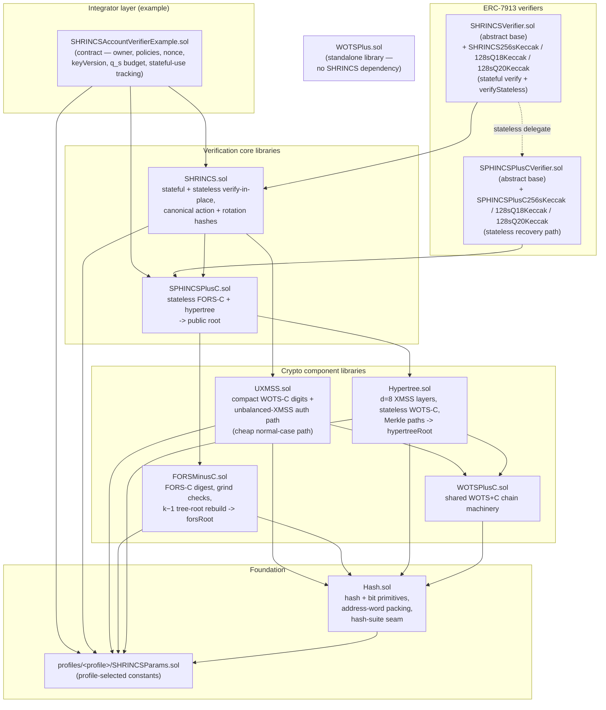
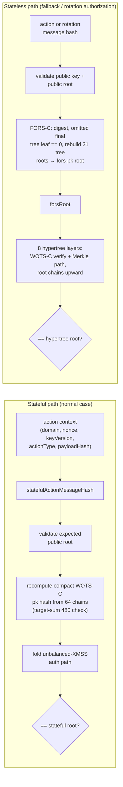

# Hash-Based Solidity Verifier Implementations

Verifier-oriented Solidity implementations of hash-based signature
schemes: the WOTS+ one-time signature scheme and the SHRINCS hybrid
stateful/stateless construction.

The production contracts in [`contracts/`](./contracts/) cover on-chain
verification only. Signer-side recovery state, seed restore logic, and
wallet lifecycle management are out of scope; test-only Solidity signer
helpers live under [`test/helpers/`](./test/helpers/) and are not
deployable.

## Implementations

Citation keys follow [CODINGSTANDARDS.md §1](./CODINGSTANDARDS.md).

- **WOTS+** ([contracts/WOTSPlus.sol](./contracts/WOTSPlus.sol)) — the
  Winternitz one-time signature scheme `[WOTSPLUS]` (A. Hülsing,
  *W-OTS+: Shorter Signatures for Hash-Based Signature Schemes*,
  AFRICACRYPT 2013; <https://eprint.iacr.org/2017/965>). Keccak-256,
  32-byte hashes and messages, Winternitz parameter `w = 16`, 67 chains
  (64 message + 3 checksum). Standalone, with no SHRINCS dependency.
  The public API (`verify`, `verifyWithRandomizationElements`, `sign`,
  `generateKeyPair`, `generateRandomizationElements`, `chain`, and the
  public constants) is stable and vector-tested; the signer-side
  helpers are reference code, documented "do not use on-chain."
- **SHRINCS** ([contracts/SHRINCS.sol](./contracts/SHRINCS.sol) and its
  component libraries) — the hybrid stateful/stateless hash-based
  construction by Kudinov and Nick `[SHRINCS]`, specified in the
  appendix of *Hash-based Signature Schemes for Bitcoin*, Cryptology
  ePrint Archive 2025/2203 (<https://eprint.iacr.org/2025/2203>).
  Compiled per profile (see [Profiles](#profiles)):
  - `256s` (default) — keccak-256, 32-byte hashes, `h = 64`, `d = 8`,
    `a = 14`, `k = 22`, 64 WOTS-C chains, 2^20 stateless budget.
    Reviewed and anchored to Rust-generated signature vectors.
  - `128s-q18` — 16-byte truncated hashes, single-layer `h = 18`
    hypertree, `a = 24`, `k = 6`, 32 WOTS-C chains, 2^18 stateless
    budget. Compiles and passes the structural test set; signature
    vectors pending Rust regeneration.
  - `128s-q20` — as `128s-q18` with a 2^20 stateless budget; same
    status.
- **SPHINCS+C** ([contracts/SPHINCSPlusC.sol](./contracts/SPHINCSPlusC.sol))
  — the stateless SPHINCS+C construction `[SPHINCSPLUSC]` (M. Kudinov,
  A. Hülsing, E. Ronen, E. Yogev, *SPHINCS+C: Compressing SPHINCS+ With
  (Almost) No Cost*, Cryptology ePrint Archive 2022/778, IEEE S&P 2023;
  <https://eprint.iacr.org/2022/778>). SHRINCS uses it as the stateless
  recovery path: a `FORS-C` few-time signature carried up a hypertree of
  `WOTS-C` layers to the public root. Deployed per profile as
  `SPHINCSPlusC256sKeccak`, `SPHINCSPlusC128sQ18Keccak`, and
  `SPHINCSPlusC128sQ20Keccak`; each SHRINCS verifier delegates its
  stateless path to the matching profile sibling.

## What SHRINCS Is

SHRINCS is a two-path signature design:

- a **stateful path**
  - cheap normal-case verification
  - compact `WOTS-C` plus an unbalanced XMSS-style authentication path
- a **stateless path**
  - fallback / recovery verification path
  - a SPHINCS-style `FORS-C + hypertree + WOTS-C` structure

Normal operation uses the cheaper stateful path. A restored or degraded
signer falls back to the stateless path. The verifier only checks signatures
and rotation authorizations; it does not track signer state. The ERC-7913
verifiers here cover both paths: each SHRINCS verifier exposes the stateful
`verify` plus a `verifyStateless` that delegates to a pinned SPHINCS+C
sibling, and the standalone SPHINCS+C verifiers check the stateless recovery
path directly.

## Repository Layout

Main contracts:

- [contracts/SHRINCSVerifier.sol](./contracts/SHRINCSVerifier.sol)
  - abstract ERC-7913 verifier for the hybrid scheme: stateful `verify`
    plus `verifyStateless` delegating to the pinned SPHINCSPlusC sibling
- [contracts/SHRINCS.sol](./contracts/SHRINCS.sol)
  - pure verification core library (facade over the component libraries):
    builds the canonical action and rotation hashes and runs the stateful
    and stateless verify-in-place logic; owns the key and envelope
    encoders/decoders bridging ERC-7913 opaque bytes to typed structures
- [contracts/Hash.sol](./contracts/Hash.sol)
  - profile-independent hash and bit primitives (address packing, hash
    masking, base-w digits, bit readers); the compile-time hash-suite seam
- [contracts/UXMSS.sol](./contracts/UXMSS.sol)
  - stateful `WOTS-C` reconstruction and unbalanced XMSS-style path
    verification
- [contracts/FORSMinusC.sol](./contracts/FORSMinusC.sol)
  - `FORS-C` digest extraction and root reconstruction
- [contracts/Hypertree.sol](./contracts/Hypertree.sol)
  - stateless `WOTS-C` and hypertree layer verification
- [contracts/WOTSPlusC.sol](./contracts/WOTSPlusC.sol)
  - shared `WOTS+C` chain machinery used by the hypertree and UXMSS
- [contracts/SPHINCSPlusCVerifier.sol](./contracts/SPHINCSPlusCVerifier.sol)
  - abstract ERC-7913 verifier for the stateless recovery path
- [contracts/SPHINCSPlusC.sol](./contracts/SPHINCSPlusC.sol)
  - stateless SPHINCS+C verification core library (`FORS-C` + hypertree +
    `WOTS-C` to the public root)
- [contracts/SHRINCS256sKeccak.sol](./contracts/SHRINCS256sKeccak.sol),
  [contracts/SHRINCS128sQ18Keccak.sol](./contracts/SHRINCS128sQ18Keccak.sol),
  [contracts/SHRINCS128sQ20Keccak.sol](./contracts/SHRINCS128sQ20Keccak.sol)
  - deployable per-profile stateful verifiers, each with a `PROFILE_TAG`;
    each pins its SPHINCS+C sibling for the stateless path
- [contracts/SPHINCSPlusC256sKeccak.sol](./contracts/SPHINCSPlusC256sKeccak.sol),
  [contracts/SPHINCSPlusC128sQ18Keccak.sol](./contracts/SPHINCSPlusC128sQ18Keccak.sol),
  [contracts/SPHINCSPlusC128sQ20Keccak.sol](./contracts/SPHINCSPlusC128sQ20Keccak.sol)
  - deployable per-profile stateless verifiers, each with a `PROFILE_TAG`
- [contracts/profiles/](./contracts/profiles/)
  - per-profile `SHRINCSParams` constant libraries (see
    [Profiles](#profiles))
- [contracts/interfaces/IERC7913SignatureVerifier.sol](./contracts/interfaces/IERC7913SignatureVerifier.sol)
  - ERC-7913 verifier interface
- [contracts/WOTSPlus.sol](./contracts/WOTSPlus.sol)
  - the standalone `WOTS+` verifier (see
    [Implementations](#implementations))
  - not used by the SHRINCS paths or the ERC-7913 verifiers
- [contracts/examples/SHRINCSAccountVerifierExample.sol](./contracts/examples/SHRINCSAccountVerifierExample.sol)
  - example account wrapper that owns nonce, rotation, and policy state

Deployment and tooling:

- [DEPLOYMENTS.md](./DEPLOYMENTS.md)
  - deployment registry: salts, predicted addresses, deploy procedure
- [script/Create3.sol](./script/Create3.sol) and
  [script/DeployBase.s.sol](./script/DeployBase.s.sol)
  - CREATE3 factory and shared deploy plumbing
- [script/DeploySHRINCS256sKeccak.s.sol](./script/DeploySHRINCS256sKeccak.s.sol),
  [script/DeploySHRINCS128sQ18Keccak.s.sol](./script/DeploySHRINCS128sQ18Keccak.s.sol),
  [script/DeploySHRINCS128sQ20Keccak.s.sol](./script/DeploySHRINCS128sQ20Keccak.s.sol),
  [script/DeploySPHINCSPlusC256sKeccak.s.sol](./script/DeploySPHINCSPlusC256sKeccak.s.sol),
  [script/DeploySPHINCSPlusC128sQ18Keccak.s.sol](./script/DeploySPHINCSPlusC128sQ18Keccak.s.sol),
  [script/DeploySPHINCSPlusC128sQ20Keccak.s.sol](./script/DeploySPHINCSPlusC128sQ20Keccak.s.sol),
  [script/DeployWOTSPlus.s.sol](./script/DeployWOTSPlus.s.sol)
  - per-profile CREATE3 deploy scripts (see [Deployment](#deployment))
- [scripts/check-line-length.sh](./scripts/check-line-length.sh)
  - 78-char line gate from [CODINGSTANDARDS.md](./CODINGSTANDARDS.md)
- [dev/export-account-vectors.sh](./dev/export-account-vectors.sh)
  - exports wrapper-ready account vectors as JSON

Architecture:



Tests (26 suites, 239 tests as of 2026-07-12, ci profile):

- [test/SHRINCSSphincs256sVectors.t.sol](./test/SHRINCSSphincs256sVectors.t.sol)
  - vector-backed verification and rotation-authorization tests
- [test/SHRINCSAccountVerifierExample.t.sol](./test/SHRINCSAccountVerifierExample.t.sol)
  - wrapper integration and state-transition tests
- [test/SHRINCSStatefulPolicyExamples.t.sol](./test/SHRINCSStatefulPolicyExamples.t.sol)
  - stateful-use policy tests
- [test/SHRINCSCalldataRetag.t.sol](./test/SHRINCSCalldataRetag.t.sol)
  - proves the calldata re-tag decoders agree with `abi.decode` over every
    vector and fuzzed well-formed envelope, and that malformed envelopes
    (wild offsets, truncation, aliasing) land in revert or `false` through
    the full verify path
- [test/SHRINCSGuardPinning.t.sol](./test/SHRINCSGuardPinning.t.sol)
  - one adversarial case per retained input guard, asserting malformed
    input classes resolve to revert or `false`
- [test/SHRINCSVerifier.t.sol](./test/SHRINCSVerifier.t.sol) and
  [test/SHRINCSCodec.t.sol](./test/SHRINCSCodec.t.sol)
  - ERC-7913 raw verifier and codec tests
- [test/SHRINCSProfileInvariants.t.sol](./test/SHRINCSProfileInvariants.t.sol)
  - structural invariants and the profile-identity guard for the active
    `SHRINCSParams` profile
- [test/SHRINCSMeasurements.t.sol](./test/SHRINCSMeasurements.t.sol)
  - gas measurement tests (figures below)
- [test/WOTSPlus.t.sol](./test/WOTSPlus.t.sol)
  - standalone `WOTS+` tests
- signer/keygen, vector-signer, facade, export, and toy-profile suites under
  [test/](./test/) exercise the test-only signing helpers

Test vectors:

- [test/test_vectors/shrincs_sphincs_256s_keccak.json](./test/test_vectors/shrincs_sphincs_256s_keccak.json)
- [test/test_vectors/shrincs_account_wrapper_vectors.json](./test/test_vectors/shrincs_account_wrapper_vectors.json)
- [test/test_vectors/wotsplus_keccak256.json](./test/test_vectors/wotsplus_keccak256.json)

## Public-Key Shape

The SHRINCS public key (`SHRINCS.PublicKey`) contains:

- `statefulPublicKey`
- `publicKeyCommitment`
- stateless `pkSeed`
- stateless `hypertreeRoot`

The stateless side follows the SPHINCS-style `PK = (PK.seed, PK.root)`
abstraction ([SPHINCSPLUS §5], [FIPS205 §9.1]):

- `pkSeed` is the global public seed used by FORS and the hypertree
- `hypertreeRoot` is the stateless public root

`publicKeyCommitment` binds the full hybrid bundle together. The verifier
checks that:

- `publicKey.publicKeyCommitment` matches the commitment recomputed from
  - `statefulPublicKey`
  - `pkSeed`
  - `hypertreeRoot`
- the caller's expected installed commitment matches that declared bundle
  commitment

This keeps the hybrid stateful/stateless public key coherent while
preserving the SPHINCS-style stateless core.

## Verification model

SHRINCS verifies signatures in place over calldata. No production verify
path copies the envelope or calls `abi.decode`, and no path walks the
envelope for canonicity.

Each verifier re-tags the calldata: it reads the ABI head offsets of the
opaque `signature` argument and points calldata-typed structs at the
signature fields where they already sit. The signature is then verified
directly from those fields. The one copy in the system is the stateless
delegation payload, which the SHRINCS verifier builds by slicing the
re-tagged signature region and forwarding it to its SPHINCS+C sibling.

The re-tag is sound because of two mechanisms:

- solc generates a calldata access check on every typed field read. An
  offset or length that falls outside the calldata bounds reverts before
  any field is used.
- a small set of retained input guards (documented in
  `docs/guard-applicability-review.md`) pins the field lengths that the
  hash construction depends on — the public-key field split, the WOTS key
  windows, and the shape and count checks that the reconstruction loops
  read.

Together these turn every malformed envelope into a revert or a `false`
return. See [Revert model](#revert-model) for the caller-visible
behavior.

## Revert model

The verify paths distinguish two failure classes:

- **Malformed envelope bytes revert.** Offsets or lengths outside the
  calldata bounds, and truncated envelopes, fail the solc calldata access
  check. The call reverts; it does not return a signature-invalid value.
- **Well-formed but invalid signatures return the failure value.** An
  envelope whose bytes are well-formed but whose signature does not verify
  returns `0xffffffff` from the ERC-7913 and ERC-1271 paths, or `false`
  from the library entry points.

Acceptance widened from the earlier canonicity-walk model: any calldata
framing whose in-place field reads reproduce a valid signature's field
values now verifies. The verifier no longer requires the byte-exact
canonical encoding. This is a superset of what `abi.decode` tolerates:
the re-tagged reads are bounds-checked against `calldatasize` (the whole
transaction calldata), not the envelope slice, so a read may extend into
adjacent calldata such as the outer ABI zero-padding. Under masked-hash
(128s) profiles the low bytes of each hash node are zero, so a
tail-truncated envelope that `abi.decode` would reject reads its stripped
tail back from that padding and still verifies. Acceptance never reaches
a wrong-accept: accepted reads always equal a valid signature's exact
field values. One qualification applies to the stateless delegation
path: it slices a bounded signature region before forwarding it to the
SPHINCS+C sibling, so a framing that reproduces those fields only by
reading out into adjacent calldata can revert or return `false` at the
sibling rather than verify there.

**Malleability caveat.** Because these field-value-equivalent framings
all verify, an external consumer that keys, caches, or deduplicates on
the raw signature bytes can see two distinct byte strings that both
verify for the same message. Consumers that need a single canonical byte
form must re-encode the signature themselves before keying on it. Nothing
in this repository keys on raw signature bytes; the wrapper's replay
protection binds the message and account state, not the signature
encoding.

## Verification Flows



Each verifier has two forms:

- the **canonical account-style form** shown below, which builds the
  canonical message hash from a typed `ActionContext`
- a raw form (`verifyStatefulUncheckedMessage`,
  `verifyStatelessUncheckedMessage`) that verifies caller-supplied message
  bytes directly; the ERC-7913 verifier and the tests use it

### 1. Stateful verification

```solidity
SHRINCS.verifyStateful(expectedPublicKeyCommitment, publicKey, actionContext, signature)
```

`verifyStateful(...)` computes a canonical hash from `ActionContext`:

- `domainSeparator`
- `nonce`
- `keyVersion`
- `actionType`
- `payloadHash`

`payloadHash` should be the hash of a typed action payload. This path does
not accept free-form account-operation bytes.

The canonical path rejects invalid contexts:

- `expectedPublicKeyCommitment == 0`
- `domainSeparator == 0`
- `actionType == 0`
- `payloadHash == 0`

Both forms verify:

- the provided `expectedPublicKeyCommitment` matches
  `publicKey.publicKeyCommitment`
- the embedded stateful public key
- compact `WOTS-C` reconstruction
- the unbalanced XMSS-style authentication path

### 2. Stateless verification

```solidity
SHRINCS.verifyStateless(expectedPublicKeyCommitment, publicKey, actionContext, signature)
```

`verifyStateless(...)` computes the same canonical `ActionContext` hash and
applies the same context rejections as the stateful path.

Both forms verify:

- the provided `expectedPublicKeyCommitment` matches
  `publicKey.publicKeyCommitment`
- `FORS-C`
- hypertree layer traversal
- stateless `WOTS-C`
- the final hypertree root against the public key

**Design note — hypertree coordinate derivation.** SHRINCS derives the
hypertree tree/leaf coordinates sequentially per layer rather than following
the [FIPS205 §8.2] index recurrence. The FORS digest fixes layer 0's
coordinate; each upper layer's leaf index is the low
`HYPERTREE_HEIGHT / NUM_HYPERTREE_LAYERS` bits of the layer below's tree
index, and its tree index is the remaining high bits.
`Hypertree.verifyHypertree` and the test signer enforce this chaining
in lockstep, so a signature cannot choose independent upper-layer addresses.
This is a deliberate, documented departure from FIPS 205 (marked
`Deviates from [FIPS205 §8.2]:` in the code); do not change either side
toward the FIPS recurrence without regenerating all vectors.

### 3. Stateful-key rotation authorization

```solidity
SHRINCS.rotateStatefulViaStateless(
    expectedPublicKeyCommitment,
    currentPublicKey,
    rotationContext,
    recoverySignature,
    nextStatefulKey
)
```

This is a verifier-side authorization helper, not signer recovery logic.

It:

- computes a canonical rotation message hash from:
  - `expectedPublicKeyCommitment`
  - `currentPublicKey.publicKeyCommitment`
  - `rotationContext`
  - `nextStatefulKey.publicKeyCommitment`
- verifies a stateless recovery signature over that canonical hash under the
  current key
- validates the proposed next stateful public key
- decodes the next stateful key and rejects `maxSignatures == 0`
- recomputes the declared next commitment from the next stateful key plus
  the current stateless seed/root
- rejects mismatches between the declared and recomputed next commitment
- rejects zero `domainSeparator`
- returns the next public key commitment on success
- returns `bytes32(0)` on failure

### 4. Full SHRINCS-key rotation authorization

```solidity
SHRINCS.statelessRotate(
    expectedPublicKeyCommitment,
    currentPublicKey,
    rotationContext,
    recoverySignature,
    nextKey
)
```

This verifies a stateless recovery signature authorizing a full next SHRINCS
key bundle.

It:

- computes a canonical full-rotation message hash from:
  - `expectedPublicKeyCommitment`
  - `currentPublicKey.publicKeyCommitment`
  - `rotationContext`
  - `nextKey.publicKeyCommitment`
- verifies the current stateless recovery signature over that canonical hash
- validates the full next key payload
- decodes the next stateful key and rejects `maxSignatures == 0`
- rejects zero `domainSeparator`
- recomputes the declared next commitment from the full next key payload
- rejects mismatches between the declared and recomputed next commitment
- returns the next public key commitment on success
- returns `bytes32(0)` on failure

### 5. ERC-1271 adapter

The example wrapper exposes:

```solidity
isValidSignature(bytes32 hash, bytes signature) external view returns (bytes4)
```

This adapter is limited to canonical account-action envelopes. It is not a
generic raw SHRINCS verifier.

Supported envelope modes:

- `0x01 || abi.encode(publicKey, actionType, payloadHash, statefulSignature)`
- `0x02 || abi.encode(publicKey, actionType, payloadHash, statelessSignature)`

The adapter:

- verifies the envelope in place over calldata
  - the mode byte selects the stateful or stateless decoder
  - the decoder re-tags the calldata offsets and reads the signature
    fields directly; it does not copy or re-materialize the structure
  - malformed envelope bytes revert; well-formed bytes that fail
    verification return `0xffffffff`
  - any framing whose in-place reads reproduce a valid signature's field
    values verifies — a superset of decode-equivalent re-encodings (see
    [Verification model](#verification-model))
- rebuilds the current `ActionContext` from wrapper-owned state
  - `domainSeparator()`
  - `nonce`
  - `keyVersion`
- checks that `hash` matches the current canonical action hash for that mode
- enforces current wrapper policy gates
  - stateful leaf policy
  - recovery-mode/stateless-budget gating
- verifies the embedded SHRINCS signature without mutating storage

Important semantics:

- ERC-1271 validity here is snapshot-based.
  - a signature can be valid now and invalid later after `nonce`,
    `keyVersion`, policy state, or key state changes
- known-mode envelopes with malformed bytes revert; well-formed
  envelopes that fail verification return `0xffffffff`
- legacy raw vectors and primitive raw SHRINCS signatures are rejected on
  this path
- stateless/key-rotation authorizations are not part of this ERC-1271
  surface
- **minimum gas:** verification runs entirely in-contract over calldata,
  with no external call. A well-formed envelope that fails verification
  returns `0xffffffff`; malformed envelope bytes and any execution
  failure, including out-of-gas, revert. A valid signature is never
  reported invalid. Callers must forward gas comfortably above the
  measured figures in [Gas measurements](#gas-measurements).

### 6. ERC-7913 raw verifier

This repository also includes a standalone
[ERC-7913](https://eips.ethereum.org/EIPS/eip-7913) verifier for the raw
stateful SHRINCS path.

`verify(bytes key, bytes32 hash, bytes signature) → bytes4`

- **key** — the 32-byte SHRINCS `publicKeyCommitment`.
- **hash** — the 32-byte message the signature is verified against; the
  caller constructs it (typically a domain-separated digest).
- **signature** — `abi.encode(PublicKey, StatefulSignature)`, the
  `SHRINCS` stateful envelope.
- For ABI-valid `verify(...)` calls, returns `0x024ad318` on success and
  `0xffffffff` on verification failure or a wrong-length key. Malformed
  envelope bytes revert: the verifier re-tags the calldata in place, and
  offsets or lengths that fall outside the calldata bounds fail the
  solc-generated access check rather than being reported as an invalid
  signature.

The envelope fields are:

- `PublicKey = (statefulPublicKey, publicKeyCommitment, pkSeed, hypertreeRoot)`
- `StatefulSignature = (randomizer, counter, chains, authPath)`

The ERC-7913 verifier is intentionally narrow:

- it supports the **stateful raw path only**
- it checks **signature validity only**
- it enforces no wrapper policy: nonce, keyVersion, actionType,
  payloadHash, and leaf-consumption tracking are all the caller's job
- the envelope carries no in-band mode tag or version prefix; the contract
  exposes a `VERSION_TAG` constant identifying its key/envelope format
  family, and each deployable subclass adds a `PROFILE_TAG` identifying
  its compiled parameter set

`SHRINCSVerifier` itself is an abstract base; the deployable contracts are
the per-profile subclasses (`SHRINCS256sKeccak`, `SHRINCS128sQ18Keccak`,
`SHRINCS128sQ20Keccak`), each compiled under its own build profile.

#### Verification semantics

At a high level, [`SHRINCSVerifier.verify(...)`](./contracts/SHRINCSVerifier.sol):

1. reads `key` as the expected bundle commitment
2. re-tags `signature` as a stateful SHRINCS envelope in place over
   calldata, with no copy
3. passes the calldata-typed structs to the `SHRINCS` library over the
   32-byte `hash`
4. calls `SHRINCS.verify(...)`, which enforces the commitment match,
   bundle shape, `WOTS-C` reconstruction, and the unbalanced-tree root
5. returns the ERC-7913 magic value on success, or `0xffffffff` on
   verification failure

A well-formed envelope that fails verification returns `0xffffffff`.
Malformed envelope bytes revert: the re-tag reads offsets and lengths
that the solc-generated calldata access check rejects when they fall
outside the calldata bounds.

`verify(...)` makes no external call: it runs entirely in-contract over
calldata, so any execution failure, including out-of-gas, reverts to the
caller rather than being misreported as an invalid signature.

#### Security scope

This path is not the same as the canonical account-wrapper flow.

The canonical wrapper binds signatures to:

- `domainSeparator`
- `nonce`
- `keyVersion`
- `actionType`
- `payloadHash`

and can also enforce stateful leaf-use policy.

The ERC-7913 raw verifier does none of that. It answers only: does this
stateful SHRINCS signature verify for this commitment and these exact 32
message bytes?

That makes it suitable as a low-level verifier surface, but not as a drop-in
replacement for the wrapper-owned account flow unless the caller supplies
the missing replay protection and policy checks externally.

### Interface choice

Use the verifier surfaces for different purposes:

- canonical wrapper functions: account authorization with nonce, keyVersion,
  action, and policy enforcement
- ERC-1271 on the example account: snapshot validation of canonical
  wrapper-owned signatures
- ERC-7913 raw verifier: low-level cryptographic validity only

For ERC-7913 blobs, callers should treat the verifier contract address as
the algorithm/version identifier. Since the envelope has no in-band version
tag, opaque blobs are fragile if stored or forwarded across verifier
families.

## Compile-Time Constants

Each build compiles the verifier for exactly one SHRINCS configuration.
Callers do not supply selectors or arbitrary numeric tuples.

The constants live in the profile-selected
`contracts/profiles/<profile>/SHRINCSParams.sol` library, imported
through the `shrincs-profile/` remapping so reference sites stay
profile-agnostic (see [Profiles](#profiles)). The default `256s` profile
pins these values (citation keys per
[CODINGSTANDARDS.md §1](./CODINGSTANDARDS.md)):

- `STATELESS_SIGNATURE_LIMIT = 2^20 = 1,048,576`
- `HASH_LEN = 32` — the `n` security parameter [FIPS205 §11]
- `HYPERTREE_HEIGHT = 64` — the `h` parameter [FIPS205 §7]
- `NUM_HYPERTREE_LAYERS = 8` — the `d` parameter [FIPS205 §7]
- `FORS_TREE_HEIGHT = 14` — the `a` parameter [SPHINCSPLUS §5.5]
- `NUM_FORS_TREES = 22` — the `k` parameter [SPHINCSPLUS §5.5]
- `WOTS_CHAIN_LEN = 16` — the `w` parameter [WOTSPLUS §3]
- `NUM_WOTS_CHAINS = 64` — the `len` parameter [WOTSPLUS §3]
- `WOTS_TARGET_SUM_STATEFUL = 480` — the WOTS-C digit-sum target,
  `len * (w - 1) / 2`
- `HASH_MASK = bytes32-of-ones` — high-aligned truncation mask applied at
  every hash-producing site; a no-op for 256s, a real truncation for the
  128s profiles
- canonical message hashes bind `HASH_SUITE_KECCAK_256`

Important distinction:

- the stateless primitive uses the `256s`-style compile-time structure
  ([FIPS205 §11]: `h = 64`, `d = 8`, `a = 14`, `k = 22`)
- `STATELESS_SIGNATURE_LIMIT = 2^20` is enforced by the wrapper/account
  layer as the maximum accepted number of stateless signatures under one
  installed stateless key
- the code pairs a `256s`-style stateless primitive with a stricter
  operational cap of `2^20`

Two verifier rules deserve explicit mention:

- `FORS-C` verifies `NUM_FORS_TREES - 1` revealed entries, not all
  `NUM_FORS_TREES`
  - the final FORS tree is omitted by construction
  - verification rejects any digest whose omitted final tree would need a
    nonzero leaf index
- `WOTS-C` uses the fixed target sum instead of an explicit checksum suffix
  - the reconstructed base-`w` digits must add up to
    `WOTS_TARGET_SUM_STATEFUL`

For the stateful `WOTS-C` / XMSS path, the code also assumes:

- `STATEFUL_PUBLIC_KEY_BYTES = 68`
  - encoded as `pkSeed || root || maxSignatures`
  - `32 + 32 + 4` bytes
- `WOTS_CHAINS_STATEFUL = 64`
  - the stateful compact `WOTS-C` signature carries 64 chains
- `WOTS_BASE_STATEFUL = 16`
  - stateful message digits are expanded in base 16
- `WOTS_TARGET_SUM_STATEFUL = 480`
  - the 64 base-16 digits must sum to 480 for the signature to verify

This is deliberate: the library claims no support for arbitrary future
numeric tuples, even ones that are superficially shape-compatible.

## Profiles

Three compile-time profiles exist, selected by the `shrincs-profile/`
Foundry remapping in `foundry.toml` (each build profile also gets its own
`out` directory):

- **`256s` (default).** The SPHINCS+-256s-style parameter set listed
  above. The split into `SHRINCSParams` kept the 256s production build
  byte-identical to the pre-split verifier (metadata-stripped deployed
  bytecode compared before/after).
- **`128s-q18` and `128s-q20`.** 16-byte truncated-hash profiles
  (`HASH_LEN = 16`, high-aligned via `HASH_MASK`), single-layer `h = 18`
  hypertree, `a = 24`, `k = 6`, 32 stateful WOTS chains. They differ only
  in the stateless budget: `2^18` for q18, `2^20` for q20. Both compile
  and pass the structural and profile-invariant test sets. Their
  signature vectors await Rust-signer regeneration, so vector-backed
  stateless coverage does not exist yet and neither profile is
  production-ready.

Build a non-default profile with `FOUNDRY_PROFILE`:

```bash
FOUNDRY_PROFILE=128s-q18 forge build
FOUNDRY_PROFILE=128s-q18 forge test
```

`test/SHRINCSProfileInvariants.t.sol` checks the active profile's
structural invariants and carries a profile-identity guard: a build whose
`shrincs-profile/` remapping was shadowed (say, by a top-level
`remappings.txt`) fails closed. CI builds, lints, and tests all three
profiles and rejects a top-level `remappings.txt`.

## On-Chain Integration State

The `SHRINCS` library is only responsible for signature verification and
rotation-authorization checking.

It manages none of the surrounding account or protocol state:

- the currently active on-chain SHRINCS public key
- nonces / sequence numbers
- key version / rotation epoch
- recovery policy flags
- pending rotation state
- balances, permissions, or other account logic

A real on-chain verifier or account contract needs an initialization step
that stores at least:

- `currentSHRINCSPublicKey`

and usually also:

- `nonce`
- `keyVersion`

This is outside the SHRINCS library itself. The library only checks whether
the provided signature or rotation authorization is valid for the provided
inputs.

The integrating contract should pass its stored `currentSHRINCSPublicKey`
into the library as `expectedPublicKeyCommitment`. The library enforces that
the provided `publicKey` bundle is pinned to that expected key.

For rotation flows, the integrating contract should also supply a
`rotationContext` carrying at least:

- `domainSeparator`
- `nonce`
- `keyVersion`

The library uses that context to build the canonical rotation message hash
that must be signed by the stateless recovery path.

## Example Wrapper Contract

The library is storage-free by design. A real on-chain verifier or account
contract must own the account state and feed that state into the library on
every call.

Reference implementation:

- [contracts/examples/SHRINCSAccountVerifierExample.sol](./contracts/examples/SHRINCSAccountVerifierExample.sol)
- [test/SHRINCSAccountVerifierExample.t.sol](./test/SHRINCSAccountVerifierExample.t.sol)
- [test/SHRINCSStatefulPolicyExamples.t.sol](./test/SHRINCSStatefulPolicyExamples.t.sol)

The example contract is intentionally small. It shows how wrapper-owned
state should interact with the library for:

- stateful action verification
- stateless action verification
- ERC-1271 view-only validation of canonical account-action envelopes
- stateless full-key rotation
- stateless usage-limit enforcement

### Stateful-use policies

The example wrapper also shows account-layer policies for handling stateful
XMSS leaf use. These are wrapper policies, not part of the `SHRINCS` library
itself.

- `StatefulPolicy.MonotonicIndex`
  - stores `nextStatefulLeafIndex`
  - accepts only the next expected leaf
  - prevents replay/rollback cleanly
  - stricter operationally because skipped leaves are not allowed
  - brittle if signer state and account state drift apart
  - a mismatch can lock out otherwise valid future leaves until the key is
    rotated or policy is changed

- `StatefulPolicy.RecoveryRotation`
  - blocks the stateful path for the entire recovery-rotation policy epoch
  - requires an explicit `enterRecoveryMode()` call before stateless
    recovery rotations are accepted
  - models the "recover, then rotate to a fresh key" workflow
  - works best when recovery mode is treated as a bridge to rotation, not as
    a long-term steady state
  - if a system enters recovery-rotation policy and never rotates out, the
    stateful path loses most of its practical value

- `StatefulPolicy.LeafBitmap`
  - stores a bitmap of used stateful leaf indices
  - rejects reuse of previously used leaves
  - allows any unused leaf to be used in any order
  - more flexible than monotonic indexing, but storage grows without bound
    as leaves are consumed
  - repeated bitmap writes can become expensive for long-lived accounts
  - better fit for small trees or higher-assurance accounts than for
    high-throughput accounts

The integrator chooses which policy fits the account design. In the example
wrapper, policy-changing functions are owner-gated.

### Policy caveats

- Policy changes are sensitive administrative actions.
  - even when owner-gated, switching policy mid-lifecycle can change which
    future stateful signatures are accepted
  - production wrappers should treat policy changes as explicit governance
    or account-owner operations
  - the example wrapper freezes policy changes after the first successful
    stateful signature in a key epoch
  - changing policy after stateful use requires rotating to a fresh key
    first

- Fresh-key rotation must reset stateful tracking state.
  - when a new SHRINCS key is installed, stale state such as:
    - `nextStatefulLeafIndex`
    - `recoveryMode`
    - active stateful policy mode
    - used-leaf bitmap marks from the prior key epoch
      must not be carried into the new key epoch
  - the example wrapper resets this state on fresh-key installation

- Raw verifier paths are lower-level interfaces.
  - the example wrapper does not expose raw stateful or raw stateless
    verification entry points
  - raw verification remains available only through lower-level libraries,
    the ERC-7913 verifier, and test harnesses
  - production account flows should prefer the canonical
    `verifyStatefulAction(...)` / `verifyStatelessAction(...)` style
    interfaces

- Stateless rotation is recovery-only in the example wrapper.
  - `rotateToFreshKey(...)` and `rotateFullKey(...)` both require
    `StatefulPolicy.RecoveryRotation`
  - both also require `recoveryMode == true`
  - this keeps stateless signatures as recovery authority rather than a
    normal-operation rotation bypass

- `RecoveryRotation` disables the stateful path immediately.
  - selecting `StatefulPolicy.RecoveryRotation` blocks stateful verification
    even before `enterRecoveryMode()`
  - `enterRecoveryMode()` only arms stateless recovery rotation; it does not
    change stateful-path availability

- Stateless usage accounting follows the stateless key, not only the bundle
  epoch.
  - `rotateToFreshKey(...)` replaces only the stateful subkey
  - it preserves the current stateless key material
  - it preserves `statelessSignaturesUsed` and first consumes one stateless
    use for the recovery signature itself
  - `rotateFullKey(...)` replaces the full bundle including the stateless
    key material
  - it resets `statelessSignaturesUsed` for the newly installed stateless
    key after consuming the recovery signature under the old key

- The example wrapper binds its signing domain to both contract identity and
  chain context.
  - the domain is derived from a stable tag, `block.chainid`, and
    `address(this)`
  - production wrappers should keep that property even if they change the
    exact domain-tag scheme

What the wrapper must handle:

- store `currentSHRINCSPublicKey`
- store and increment `nonce`
- store and increment `keyVersion`
- store and enforce `statelessSignaturesUsed < STATELESS_SIGNATURE_LIMIT`
- define a stable `domainSeparator`
- define the typed action payloads whose hash becomes `payloadHash`
- decide which path is allowed for which operation
- update stored key state only after successful rotation authorization

What the wrapper should not delegate to users:

- choosing `expectedPublicKeyCommitment`
- choosing the stored `nonce`
- choosing the stored `keyVersion`
- choosing an empty `domainSeparator`
- bypassing the typed `payloadHash` flow for normal account operations
- changing stateful-use policy unless explicitly authorized

## Test Coverage

Current tests cover:

### Stateful path

- valid stateful signature verifies
- wrong message is rejected
- wrong public key is rejected
- wrong expected public root is rejected
- zero expected public-key commitment is rejected
- corrupted stateful signature is rejected
- tampered stateful authentication path is rejected
- mismatched stateless root is rejected
- signature at `maxSignatures` boundary verifies
- signature exceeding `maxSignatures` is rejected
- malformed `pkSeed` length is rejected
- malformed stateful public-key length is rejected
- wrong stateful `WOTS-C` chain count is rejected
- empty stateful authentication path is rejected
- canonical action hash changes when payload changes
- zeroed account-style action context is rejected

### Stateless path

- valid stateless signature verifies
- wrong message is rejected
- tampered `FORS` data is rejected
- tampered hypertree `WOTS-C` public-key hash is rejected
- tampered hypertree authentication path is rejected
- tampered component public-key vector is rejected
- wrong expected public root is rejected
- zero expected public-key commitment is rejected
- malformed `pkSeed` length is rejected
- malformed `hypertreeRoot` length is rejected
- empty hypertree signatures are rejected
- dropped hypertree layers are rejected
- dropped `FORS` entries are rejected
- short `FORS` randomizers, secret leaves, auth paths, and auth nodes are
  rejected
- hypertree leaf index out of range is rejected
- malformed hypertree `WOTS-C` chain length is rejected
- wrong hypertree authentication path length is rejected
- canonical action hash changes when nonce changes
- zeroed account-style action context is rejected

### Rotation authorization helpers

- `rotateStatefulViaStateless(...)`
  - canonical rotation hash changes when the next stateful key changes
  - rejects legacy stateless signatures that were not signed over the
    canonical rotation hash
  - rejects malformed next stateful public key
  - rejects next stateful keys with `maxSignatures == 0`
  - rejects zero `domainSeparator`

- `statelessRotate(...)`
  - canonical rotation hash changes when the next key bundle changes
  - rejects legacy stateless signatures that were not signed over the
    canonical rotation hash
  - rejects malformed next key bundles
  - rejects next stateful keys with `maxSignatures == 0`
  - rejects zero `domainSeparator`

### Example wrapper policies

- wrapper initialization stores the expected owner, key, nonce, key version,
  and default policy state
- failed wrapper verification and rotation calls preserve account state
- wrapper domain separators differ across contract instances
- owner-gated policy changes are enforced
- non-owner policy changes are rejected
- non-owner recovery-mode toggles are rejected
- entering recovery mode outside `RecoveryRotation` policy reverts
- monotonic-index policy rejects rollback to an earlier expected leaf
- default monotonic-index policy rejects repeated use of the same valid
  stateful leaf
- monotonic-index policy accepts the expected leaf once and rejects replay
- monotonic-index policy rejects unexpected leaf indices
- policy changes freeze after the first successful stateful use in a key
  epoch
- recovery-rotation policy blocks stateful use after recovery mode is
  entered
- under `RecoveryRotation`, stateless action verification is rejected until
  the owner enters recovery mode
- full-key rotation requires `RecoveryRotation` policy and entered recovery
  mode
- recovery-rotation policy rejects legacy rotation authorization and stays
  in recovery mode
- leaf-bitmap policy marks a leaf as used and rejects reuse
- fresh-key installation clears stale stateful tracking state
- fresh-key installation resets the leaf-bitmap namespace
- fresh-key installation always resets stateless usage
- fresh-key installation unfreezes policy changes for the new key epoch
- ERC-1271 rejects malformed, unknown-mode, and legacy raw-signature
  envelopes without mutating state
- stateless action verification and rotation reject calls at the stateless
  usage limit
- stateful-only rotation consumes one stateless recovery use and preserves
  stateless usage accounting
- stateful-only rotation at the final stateless slot consumes it and rejects
  the next stateless use
- repeated stateful-only rotation does not mint fresh stateless budget
- full-key rotation consumes one stateless recovery use under the old key
  and resets stateless usage accounting for the new key
- stateful-only and full-key rotations emit dedicated stateless-usage events

### Calldata re-tag and envelope handling

- the calldata re-tag decoders agree with `abi.decode` over every vector
  and fuzzed well-formed envelope
- any framing whose in-place reads reproduce a valid signature's field
  values verifies — a superset of decode-equivalent re-encodings that,
  under masked-hash profiles, includes tail truncations read back from
  ABI padding
- malformed envelope bytes (wild offsets, oversized lengths, in-bounds
  aliasing) land in revert or `false` through the full verify path

### ERC-7913 raw verifier and codec

- ERC-7913 `verify(...)` returns `0x024ad318` for a valid stateful raw
  signature
- valid signatures from multiple in-budget stateful leaves verify
- wrong key lengths return `0xffffffff` without reverting
- wrong commitments, tampered hashes, tampered WOTS chains, tampered auth
  paths, and mismatched key bundles return `0xffffffff`
- empty, garbage, truncated, trailing-byte, and malformed SHRINCS envelopes
  are rejected
- fuzzed ABI-valid `verify(...)` inputs return the failure value instead of
  reverting
- `SHRINCS.decodePublicKeyCommitment(...)` accepts exactly 32-byte keys and rejects
  other lengths without reverting
- `SHRINCS.statefulEnvelope(...)` re-tags canonical and other
  field-value-equivalent framings in place, and reverts on out-of-bounds
  offsets or lengths
- `SPHINCSPlusC.toMessage(...)` maps the ERC-7913 `bytes32 hash` to exactly
  those 32 packed bytes
- ERC-7913 consumer examples accept `verifier || key` signers and reject
  no-code, wrong-verifier, short-signer, and non-magic-return cases
- 20-byte signer values use the ERC-1271 fallback path rather than ERC-7913
  with an empty key

### Test-only signer and export helpers

- Solidity keygen rejects zero and excessive stateful budgets
- Solidity keygen is deterministic for a fixed seed and matches Rust output
- test-only stateful signing advances the signing leaf and rejects exhausted
  keys
- canonical stateful-action signing rejects malformed public-key commitment
  fields
- staged and high-level stateless vector signing produce verifier-feedable
  signatures
- account-aware signer helpers produce action and rotation signatures that
  the example wrapper accepts
- account-vector export produces wrapper-ready action and rotation bundles,
  including calldata and ERC-1271 envelopes

### Toy stateless profile

- toy stateless signing verifies successfully
- toy stateless signing is deterministic

## Gas Measurements

Measured 2026-07-12 at this repository's default profile
settings (`via_ir = true`, optimizer runs 200) by
[test/SHRINCSMeasurements.t.sol](./test/SHRINCSMeasurements.t.sol), except
the `stateful, adapter direct` row, which is measured by
`SHRINCSVerifier.t.sol::testGasSnapshotHappyPathVerify`. The
ERC-1271 figures verify the envelope in place over calldata; the ERC-7913
delegation figure is `verifyStateless` calling its SPHINCS+C sibling.

| Path                              | Gas       |
|-----------------------------------|-----------|
| stateful, canonical wrapper call  | 194,574   |
| stateful, ERC-1271                | 171,561   |
| stateful, adapter direct          | 348,786   |
| stateless, canonical wrapper call | 1,680,697 |
| stateless, ERC-1271               | 1,658,664 |
| stateless delegation, ERC-7913    | 1,667,626 |

For the stateful profile the ERC-1271 figure falls below the canonical
wrapper call: the wrapper builds and validates the typed `ActionContext`
and canonical hash on-chain, whereas the ERC-1271 path verifies a
precomputed hash, and the in-place re-tag verification costs less than
that context machinery.

Reproduce with:

```bash
forge test --match-contract SHRINCSMeasurements -vv
forge test --match-test testGasSnapshotHappyPathVerify -vv
```

The stateful entrypoints make no external call, so their execution
failures (including out-of-gas) simply revert. The stateless delegation
(`verifyStateless` calling its SPHINCS+C sibling) is the one remaining
external call; an out-of-gas there reverts rather than being misreported
as `0xffffffff` (see the ERC-1271 and ERC-7913 sections above). Either
way, forward gas comfortably above these figures.

## Development

This project uses Foundry for Solidity build and test work. Coding rules,
citation conventions, and the enforcement gates (format, lint, line cap,
tests, static analysis, and fuzz/invariant properties) are defined in
[CODINGSTANDARDS.md](./CODINGSTANDARDS.md) §8; GitLab CI runs them all.

### Prerequisites

Install Foundry:

```bash
curl -L https://foundry.paradigm.xyz | bash
foundryup
```

## Build

The default `foundry.toml` profile sets `via_ir = true`, which the SHRINCS
verifier requires to avoid stack-too-deep compilation failures:

```bash
forge build
```

To build a non-default profile, set `FOUNDRY_PROFILE`
(`FOUNDRY_PROFILE=128s-q18 forge build`); see [Profiles](#profiles) and the
profile sections in `foundry.toml`.

## Test

Run the full verifier test suite:

```bash
forge test
```

Expected result as of 2026-07-12 on the default profile:
`239 tests passed, 0 failed`.

### Using Rust-Generated SHRINCS Vectors

The Solidity verifier tests are intended to consume vectors generated by the
Rust SHRINCS signer/keygen implementation. The Solidity code verifies those
vectors; it does not generate production signing material.

The vector file expected by this repository is:

```text
test/test_vectors/shrincs_sphincs_256s_keccak.json
```

From the Rust repository, generate the vector file:

```bash
cargo test --test generate_shrincs_vectors -- --ignored --nocapture
```

The Rust generator writes:

```text
tests/test_vectors/shrincs_sphincs_256s_keccak.json
```

Copy that file into this Solidity repository:

```bash
cp /path/to/hashsigs-rs/tests/test_vectors/shrincs_sphincs_256s_keccak.json \
  /path/to/hashsigs-solidity/test/test_vectors/shrincs_sphincs_256s_keccak.json
```

Then run the SHRINCS-only Solidity tests:

```bash
forge test --match-contract SHRINCSSphincs256sVectorsTest -vv
forge test --match-contract SHRINCSAccountVerifierExampleTest -vv
```

The vector JSON contains the Rust-generated public keys, messages,
signatures, and negative/tampered cases. It also includes compatibility
calldata fields used by the current Foundry vector decoder.

### Test-Only Signer Helpers

This repository also contains test-only Solidity signer helpers under
[`test/helpers/`](./test/helpers/). These are not part of the production
verifier surface in [`contracts/`](./contracts/).

- [`test/helpers/SHRINCSTestSigner.sol`](./test/helpers/SHRINCSTestSigner.sol)
  - deterministic Solidity keygen plus stateful signing helpers
  - used to mirror Rust signer behavior in tests
- [`test/helpers/SHRINCSStatelessVectorSigner.sol`](./test/helpers/SHRINCSStatelessVectorSigner.sol)
  - staged storage-backed stateless signer for exact production-profile
    vector generation
  - splits FORS and hypertree work across multiple calls to avoid EVM memory
    blowups
- [`test/helpers/SHRINCSStatelessVectorSigningFacade.sol`](./test/helpers/SHRINCSStatelessVectorSigningFacade.sol)
  - thin test facade that drives the staged stateless signer through a
    simpler `signFromSeed(...)` / `completeSession(...)` API
- [`test/helpers/SHRINCSAccountSigningFacade.sol`](./test/helpers/SHRINCSAccountSigningFacade.sol)
  - test-only account-aware signer facade for canonical wrapper flows
  - rebuilds the live wrapper-owned `domainSeparator`, `nonce`, and
    `keyVersion` before signing stateful actions, stateless actions, and
    both rotation messages
- [`test/helpers/SHRINCSAccountVectorExport.sol`](./test/helpers/SHRINCSAccountVectorExport.sol)
  - packages account-aware signatures into wrapper-feedable bundles
  - exports canonical message bytes, `abi.encodeCall(...)` payloads, and
    ERC-1271 envelopes

Use these helpers for tests, debugging, and local vector generation only.
They are not deployable wallet or signer contracts.

### Account-Aware Signer and Export Flow

The account wrapper signs canonical, wrapper-owned messages, so test
signing must bind:

- `domainSeparator`
- `nonce`
- `keyVersion`
- `actionType`
- `payloadHash`

for action flows, and the wrapper-owned rotation context for recovery flows.

The test-only account-aware path is:

- [`test/helpers/SHRINCSAccountSigningFacade.sol`](./test/helpers/SHRINCSAccountSigningFacade.sol)
  - creates wrapper-bound stateful action signatures
  - creates wrapper-bound stateless action signatures
  - creates wrapper-bound stateless recovery signatures for
    `rotateToFreshKey(...)` and `rotateFullKey(...)`
- [`test/helpers/SHRINCSAccountVectorExport.sol`](./test/helpers/SHRINCSAccountVectorExport.sol)
  - converts those signatures into exportable bundles that can be fed
    directly into the live wrapper
- [`test/SHRINCSAccountVectorExport.t.sol`](./test/SHRINCSAccountVectorExport.t.sol)
  - emits the bundle bytes and immediately proves the wrapper accepts them

Run the export suite directly:

```bash
forge test --match-path test/SHRINCSAccountVectorExport.t.sol -vv
```

Or generate a JSON artifact from the emitted bundle bytes:

```bash
bash dev/export-account-vectors.sh
```

The default output artifact is:

```text
test/test_vectors/shrincs_account_wrapper_vectors.json
```

To cross-check these Solidity-exported account vectors against the Rust
verifier, copy that JSON into the Rust repository manually. The repositories
are separate, so this handoff is intentionally not automated:

```bash
cp /path/to/hashsigs-solidity/test/test_vectors/shrincs_account_wrapper_vectors.json \
  /path/to/hashsigs-rs/tests/test_vectors/shrincs_account_wrapper_vectors.json
```

Then run the Rust-side cross-check from `hashsigs-rs`:

```bash
cargo test --test solidity_account_vectors
```

The export tests emit four wrapper-feedable bundle categories:

- `testExportStatefulActionBundle`
  - `stateful_vector_abi`:
    ABI encoding of the full exported stateful-action bundle
  - `stateful_verify_calldata`:
    calldata for `verifyStatefulAction(...)`
  - `stateful_1271_envelope`:
    ERC-1271 payload for canonical stateful-action validation
- `testExportStatelessActionBundle`
  - `stateless_vector_abi`:
    ABI encoding of the full exported stateless-action bundle
  - `stateless_verify_calldata`:
    calldata for `verifyStatelessAction(...)`
  - `stateless_1271_envelope`:
    ERC-1271 payload for canonical stateless-action validation
- `testExportStatefulOnlyRotationBundle`
  - `stateful_rotation_vector_abi`:
    ABI encoding of the full exported stateful-only rotation bundle
  - `stateful_rotation_calldata`:
    calldata for `rotateToFreshKey(...)`
- `testExportFullRotationBundle`
  - `full_rotation_vector_abi`:
    ABI encoding of the full exported full-rotation bundle
  - `full_rotation_calldata`:
    calldata for `rotateFullKey(...)`

These exports are intended for local tooling, debugging, and cross-repo
vector work. They are not a production signer interface.

## Deployment

The canonical SHRINCS verifiers, their SPHINCSPlusC stateless delegates,
and the WOTS+ library deploy through CREATE3 Foundry scripts. A CREATE3
address depends only on the factory and salt, not on the init code, so
each verifier profile gets a distinct, chain-invariant address.
[DEPLOYMENTS.md](./DEPLOYMENTS.md) is the registry: it holds the salts,
profile tags, predicted addresses, the deploy procedure, and the
historical CREATE2 (verifier) and Hardhat-Ignition (WOTS+) mechanisms
these scripts replace.

Deploy each SPHINCSPlusC delegate before its SHRINCS sibling: CREATE3
fixes the address either way, but `SHRINCSVerifier.verifyStateless`
reverts on empty code, and each SHRINCS deploy script asserts its sibling
is already deployed at the pinned address.

- `script/DeploySPHINCSPlusC256sKeccak.s.sol` — 256s stateless delegate
  (profile `production`)
- `script/DeploySHRINCS256sKeccak.s.sol` — 256s verifier (profile
  `production`)
- `script/DeploySPHINCSPlusC128sQ18Keccak.s.sol` — 128s-q18 delegate
  (profile `production-128s-q18`)
- `script/DeploySHRINCS128sQ18Keccak.s.sol` — 128s-q18 verifier
  (profile `production-128s-q18`)
- `script/DeploySPHINCSPlusC128sQ20Keccak.s.sol` — 128s-q20 delegate
  (profile `production-128s-q20`)
- `script/DeploySHRINCS128sQ20Keccak.s.sol` — 128s-q20 verifier
  (profile `production-128s-q20`)
- `script/DeployWOTSPlus.s.sol` — WOTS+ library (profile `production`)

Each script asserts its `FOUNDRY_PROFILE` and refuses to run under the
wrong one. Example:

```bash
FOUNDRY_PROFILE=production forge script \
    script/DeploySHRINCS256sKeccak.s.sol \
    --rpc-url $RPC --private-key $DEPLOYER_PK --broadcast --verify
```

SHRINCS is testnet-only. The 128s-q20 stateless budget (2^20) wants
profile security-analysis backing before production use, and the 128s
verifiers need the regenerated 128s vectors before a deploy is
production-ready. The example wrapper
(`contracts/examples/SHRINCSAccountVerifierExample.sol`) is a reference
integration, not a canonical deployment; deploy it directly with
`forge create` when you need one.

## Notes

- `forge-std` is a git submodule at `lib/forge-std`.
- the default Foundry profile sets `via_ir = true`; the verifier relies on
  it for clean builds.

## License

Copyright (C) 2024-2026 quip.network

This program is free software: you can redistribute it and/or modify
it under the terms of the GNU Affero General Public License as published by
the Free Software Foundation, either version 3 of the License, or
(at your option) any later version.

This program is distributed in the hope that it will be useful,
but WITHOUT ANY WARRANTY; without even the implied warranty of
MERCHANTABILITY or FITNESS FOR A PARTICULAR PURPOSE. See the
GNU Affero General Public License for more details.

You should have received a copy of the GNU Affero General Public License
along with this program. If not, see <https://www.gnu.org/licenses/>.
